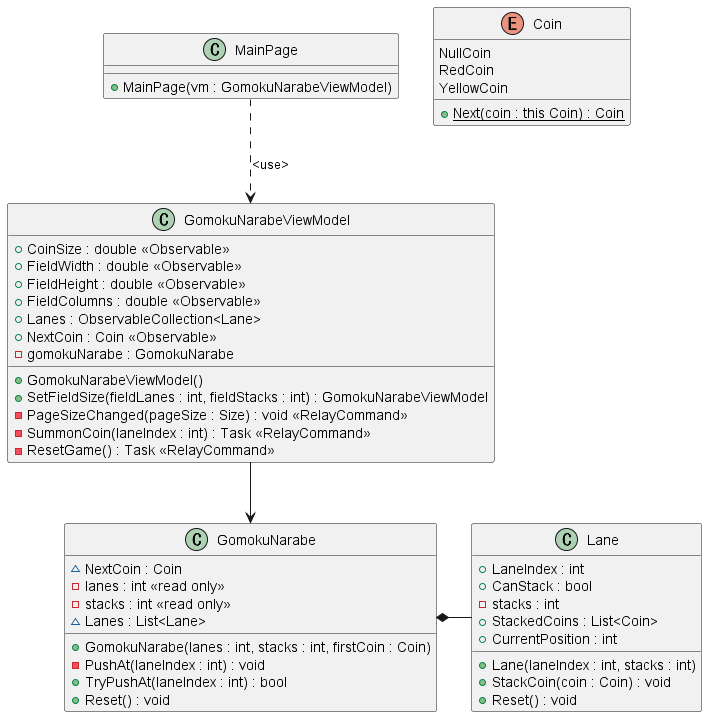
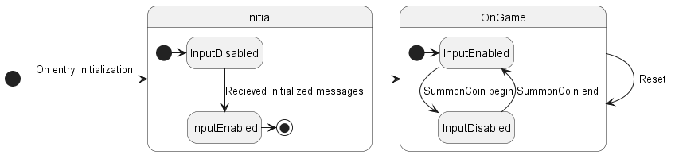
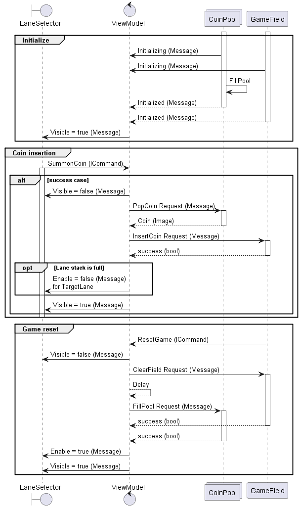

# MauiGomokuNarabeGame
A digital game board for Gomoku Narabe (五目並べ)

https://github.com/tatsuya19871219/MauiGomokuNarabeGame/assets/7810461/480ae0fb-80e0-420d-ad89-a5629df30c1d

## What I learnt from this project

- How to use [RelayCommand](https://learn.microsoft.com/en-us/dotnet/communitytoolkit/mvvm/generators/relaycommand) Attribute
- How to await a replay collection of RequestMessage from multiple subscribers

## UML

Class diagram

State diagram

Sequence diagram

## Files edited

Summary

 - Helpers/
     - [ConditionalAction.cs](./Helpers/ConditionalAction.cs)
     - [OnceAtATimeAction.cs](./Helpers/OnceAtATimeAction.cs)
 - Messages/
     - [ClearFieldRequestMessage.cs](./Messages/ClearFieldRequestMessage.cs)
     - [FillPoolRequestMessage.cs](./Messages/FillPoolRequestMessage.cs)
     - [InitializedMessage.cs](./Messages/InitializedMessage.cs)
     - [InitializingMessage.cs](./Messages/InitializingMessage.cs)
     - [InsertCoinRequestMessage.cs](./Messages/InsertCoinRequestMessage.cs)
     - [LaneSelectorEnableMessage.cs](./Messages/LaneSelectorEnableMessage.cs)
     - [LaneSelectorVisibleMessage.cs](./Messages/LaneSelectorVisibleMessage.cs)
     - [PopCoinRequestMessage.cs](./Messages/PopCoinRequestMessage.cs)
 - Models/
     - [Coin.cs](./Models/Coin.cs)
     - [Lane.cs](./Models/Lane.cs)
 - Views/
     - [CoinImage.cs](./Views/CoinImage.cs)
     - [CoinPool.xaml](./Views/CoinPool.xaml)
     - [CoinPool.xaml.cs](./Views/CoinPool.xaml.cs)
     - [GameField.xaml](./Views/GameField.xaml)
     - [GameField.xaml.cs](./Views/GameField.xaml.cs)
     - [LaneSelector.xaml](./Views/LaneSelector.xaml)
     - [LaneSelector.xaml.cs](./Views/LaneSelector.xaml.cs)
 - [DoublesToSizeConverter.cs](./DoublesToSizeConverter.cs)
 - [GomokuNarabe.cs](./GomokuNarabe.cs)
 - [GomokuNarabeViewModel.cs](./GomokuNarabeViewModel.cs)
 - [MainPage.xaml](./MainPage.xaml)
 - [MainPage.xaml.cs](./MainPage.xaml.cs)

</datilas>
